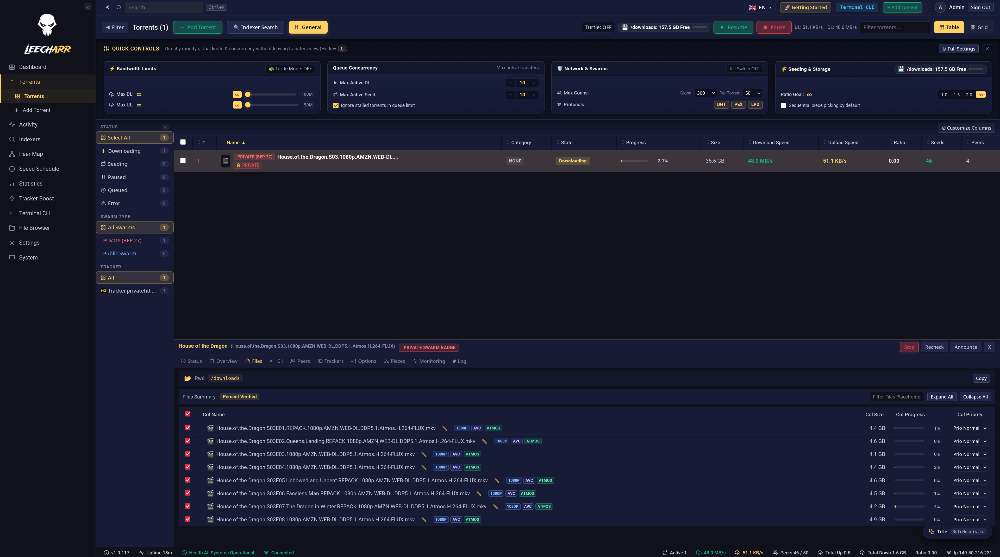

# Leecharr

**High-Performance BitTorrent & Media Downloader** — purpose-built for the Servarr (*arr) ecosystem

<table>
  <tr>
    <td><a href="https://www.leecharr.net"></a></td>
    <td><a href="https://github.com/dmzoneill/Leecharr/actions/workflows/main.yml"></a></td>
    <td><a href="https://github.com/dmzoneill/Leecharr/releases/latest"></a></td>
    <td><a href="https://github.com/dmzoneill/Leecharr/blob/main/LICENSE"></a></td>
    <td><a href="https://hub.docker.com/r/feeditout/leecharr"></a></td>
  </tr>
  <tr>
    <td><a href="https://ghcr.io/dmzoneill/leecharr"></a></td>
    <td></td>
    <td></td>
    <td></td>
    <td></td>
  </tr>
</table>

---

{{CHANGELOG}}

---

## What is Leecharr?

**Leecharr** is a modern, high-performance BitTorrent and media downloader purpose-built for the Servarr (`*arr`) ecosystem (Sonarr, Radarr, Lidarr, Prowlarr, Readarr).

Unlike conventional standalone clients (Deluge, qBittorrent, Transmission) that present torrents as raw filenames and technical progress bars, Leecharr **deeply enriches active downloads with metadata and artwork** directly from Sonarr, Radarr, and Lidarr &mdash; giving you movie posters, TV show banners, episode screenshots, artist fanart, media stream specs, and cast overviews in a unified, beautiful Servarr interface.

<p align="center">
  
</p>

---

## Key Features

### 🌟 Deep *arr Media Enrichment
- **Automatic Media Correlation:** Matches torrents by release title, info hash, or `*arr` download ID to pull rich media metadata.
- **Visual Media Experience:** Displays high-res posters, fanart backdrops, season banners, and episode titles.
- **Season Pack Hierarchy:** Automatically groups multi-file TV season packs by Show &rarr; Season &rarr; Episode.
- **Media Stream Info:** Shows resolution (4K, 1080p), HDR format (Dolby Vision, HDR10+), audio codecs (Dolby Atmos, TrueHD, FLAC), and subtitle tracks.

### ⚡ Pure C# .NET 10 BitTorrent Engine
- **Rarest-First & Endgame Mode:** Optimal swarm health and piece distribution.
- **Sequential Download Mode:** Enables instant **video streaming and file previewing** while actively downloading.
- **Per-File Priority Management:** Skip unwanted files or prioritize specific files.
- **Non-Blocking Async Disk I/O:** Write/read caching (64MB–512MB) and sparse pre-allocation to prevent disk bottlenecking.
- **Fast Resume Persistence:** Checkpoints piece bitfields and states to SQLite for instant startup without full re-hashing.
- **MSE/PE Stream Encryption:** Diffie-Hellman 768-bit key exchange + RC4 stream cipher.
- **BEP Protocol Support:** HTTP & UDP Trackers (BEP 3, BEP 15, BEP 12 Multi-Tracker), DHT (BEP 5), PEX (BEP 11), `ut_metadata` (BEP 9), Fast Extension (BEP 6), LPD (BEP 14), and uTP (BEP 29).

### 🔌 Download Client Compatibility
- **Deluge JSON-RPC Adapter:** Connects seamlessly to tools expecting Deluge daemon.
- **qBittorrent WebAPI v2 Adapter:** Acts as a drop-in qBittorrent client for existing apps.
- **Transmission RPC Adapter:** Compatible with Transmission remote clients.
- **Native Leecharr REST API v1 & SignalR:** Sub-second push for speed pulses, piece maps, and swarm events.

---

## ⚡ Quick Start

### Run with Podman / Docker

```bash
docker run -d \
  --name leecharr \
  -p 7889:7889 \
  -p 7890:7890/tcp \
  -p 7890:7890/udp \
  -v leecharr-config:/config \
  -v leecharr-downloads:/downloads \
  --restart unless-stopped \
  feeditout/leecharr:latest
```

### Docker Compose (`docker-compose.yml`)

```yaml
services:
  leecharr:
    image: feeditout/leecharr:latest
    container_name: leecharr
    restart: unless-stopped
    ports:
      - "7889:7889"
      - "7890:7890/tcp"
      - "7890:7890/udp"
    volumes:
      - /opt/leecharr/config:/config
      - /opt/leecharr/downloads:/downloads
    environment:
      - PUID=1000
      - PGID=1000
      - TZ=Etc/UTC
```

---

## Links & Resources

- **Website:** [https://www.leecharr.net](https://www.leecharr.net)
- **Source Code:** [https://github.com/dmzoneill/Leecharr](https://github.com/dmzoneill/Leecharr)
- **Documentation:** [https://github.com/dmzoneill/Leecharr/tree/main/docs](https://github.com/dmzoneill/Leecharr/tree/main/docs)

---

Distributed under the **Apache License 2.0**.
