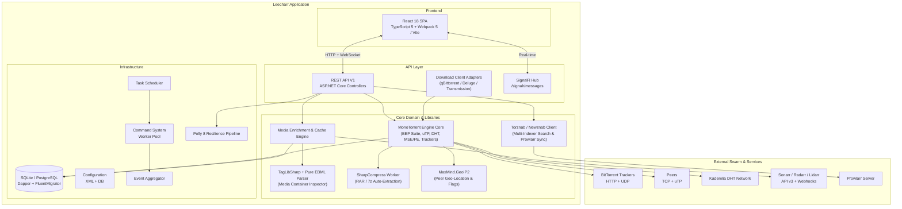
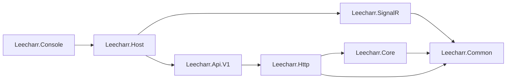

# Leecharr Architecture & Integration Blueprint

## System Overview

Leecharr is a high-performance, rich media BitTorrent and media downloader built on the Servarr (`*arr`) application framework (Sonarr, Radarr, Lidarr, Seedarr). It pairs a multi-threaded C# BitTorrent download engine with deep, bi-directional media metadata enrichment.

---

## Integrated Library Stack

Leecharr leverages a curated set of battle-tested, pure-managed .NET libraries to provide protocol robustness, media decoding, and feature parity:

| Subsystem | Selected Library | NuGet Package | License | Role in Leecharr |
| :--- | :--- | :--- | :--- | :--- |
| **BitTorrent Protocol Engine** | **MonoTorrent** | `MonoTorrent` | MIT | Full BEP protocol suite (BEP 3, 5, 6, 9, 10, 11, 12, 14, 15, 21, 23, 27, 29 uTP, MSE/PE stream encryption). Wrapped behind `IDownloadEngine`. |
| **Media & Container Inspection** | **TagLib# + Custom EBML** | `TagLibSharp` | LGPL-2.1 | Pure C# metadata inspection extracting video resolution, audio codecs, bitrates, audio channels, and stream properties without external CLI dependencies. |
| **Archive Decompression** | **SharpCompress** | `SharpCompress` | MIT | Pure C# extraction of multi-part RAR (including RAR5), ZIP, 7-Zip, TAR, and GZ archives upon torrent completion (Deluge Extractor parity). |
| **Peer Geo-Location & Flags** | **MaxMind.GeoIP2** | `MaxMind.GeoIP2` | Apache-2.0 | Pure C# reader for `.mmdb` GeoIP databases to display country flags in the Swarm Inspector (Deluge parity). |
| **Outbound HTTP Resilience** | **Polly 8** | `Polly` / `Polly.Core` | BSD-3 | Exponential backoff retries, timeouts, and circuit breakers for Webhooks and Torznab indexer queries. |
| **Datastore & Migrations** | **Dapper & FluentMigrator** | `Dapper`, `FluentMigrator` | Apache-2.0 | High-performance micro-ORM with versioned, sequential schema migrations. |
| **Dependency Injection** | **DryIoc** | `DryIoc` | MIT | High-speed Servarr DI container matching Singleton interfaces to Transient classes. |

---

## Project Dependency Graph

| Project | Directory | Responsibility |
| :--- | :--- | :--- |
| `Leecharr.Common` | `NzbDrone.Common/` | DI container (DryIoc), logging (NLog), HTTP utilities, disk operations, serialization, caching |
| `Leecharr.Core` | `NzbDrone.Core/` | Domain logic: MonoTorrent engine provider, media enrichment, TagLibSharp inspector, SharpCompress extractor, MaxMind GeoIP, Torznab indexers, Webhooks |
| `Leecharr.SignalR` | `NzbDrone.SignalR/` | SignalR hub for sub-second browser updates (progress, speed pulses, piece maps, swarms) |
| `Leecharr.Http` | `Leecharr.Http/` | REST framework, middleware, auth, versioned routing |
| `Leecharr.Api.V1` | `Leecharr.Api.V1/` | Native REST controllers & compatibility adapters (qBittorrent, Deluge, Transmission) |
| `Leecharr.Host` | `NzbDrone.Host/` | Kestrel web server (Port 7889), startup pipeline, middleware registration |
| `Leecharr.Console` | `NzbDrone.Console/` | Console entry point, restart loop |
| `Leecharr.Frontend` | `Leecharr.Frontend/` | React 18 SPA (TypeScript 5, Webpack 5 / Vite) |

---

## Dependency Injection (DryIoc)

- **Interfaces** registered as **Singleton** (single instance across application lifetime).
- **Concrete classes** registered as **Transient** (new instance per resolution).
- Conventional auto-wiring (`ITorrentService` + `TorrentService` auto-matched by container scanner).

---

## Database Layer

Entity persistence is managed via **Dapper** with **FluentMigrator** migrations supporting SQLite (default) and PostgreSQL.
All models extend `ModelBase` (Id) or `ProviderDefinition` (Id, Name, Implementation, ConfigContract, Settings, Enable, Priority).
