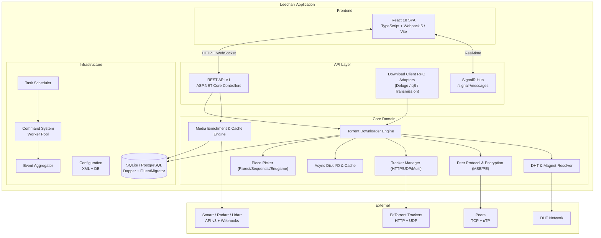
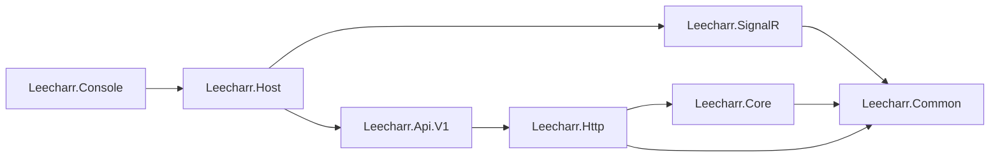

# Leecharr Architecture

## System Overview

Leecharr is a rich media BitTorrent and download client built on the Servarr (`*arr`) application framework (Sonarr, Radarr, Lidarr, Seedarr). It pairs a multi-threaded C# BitTorrent download engine with deep, bi-directional media metadata enrichment.

## Project Dependency Graph

| Project | Directory | Responsibility |
| :--- | :--- | :--- |
| `Leecharr.Common` | `NzbDrone.Common/` | DI container (DryIoc), logging (NLog), HTTP utilities, disk operations, serialization, caching |
| `Leecharr.Core` | `NzbDrone.Core/` | Domain logic: torrent downloading, piece picker, async disk I/O, trackers, peers, protocols, media enrichment, *arr sync |
| `Leecharr.SignalR` | `NzbDrone.SignalR/` | SignalR hub for sub-second browser updates (progress, speed pulses, piece maps, swarms) |
| `Leecharr.Http` | `Leecharr.Http/` | REST framework, middleware, auth, versioned routing |
| `Leecharr.Api.V1` | `Leecharr.Api.V1/` | API controllers & download client compatibility RPC endpoints |
| `Leecharr.Host` | `NzbDrone.Host/` | Kestrel web server, startup pipeline, middleware registration |
| `Leecharr.Console` | `NzbDrone.Console/` | Console entry point, restart loop |
| `Leecharr.Frontend` | `Leecharr.Frontend/` | React 18 SPA (TypeScript, Webpack 5 / Vite) |

## Dependency Injection (DryIoc)

- **Interfaces** registered as **Singleton** (single instance across application lifetime).
- **Concrete classes** registered as **Transient** (new instance per resolution).
- Conventional auto-wiring (`ITorrentService` + `TorrentService` auto-matched by container scanner).

## Database Layer

Entity persistence is managed via **Dapper** with **FluentMigrator** migrations supporting SQLite (default) and PostgreSQL.
All models extend `ModelBase` (Id) or `ProviderDefinition` (Id, Name, Implementation, ConfigContract, Settings, Enable, Priority).
