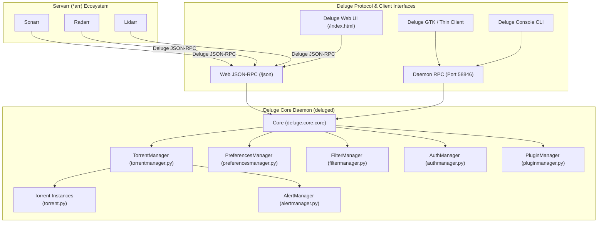

# Deluge Architecture, Protocol & Feature Requirements Specification

This document provides a comprehensive deconstruction of **Deluge** (from the canonical source at `/home/daoneill/src/usr/deluge`) and defines the exact requirements for Leecharr's Deluge compatibility, protocol features, queue management, status models, and plugin feature parity.

---

## 1. Deluge System Architecture Deconstruction

Deluge follows a decoupled client-server architecture centered around the daemon (`deluged`):



### Core Subsystems
1. **`Core` (`deluge/core/core.py`):** Central coordinator exposing exported methods via RPC decorators (`@export`). Manages the underlying BitTorrent session, global rate limits, interface binding, and session status statistics.
2. **`TorrentManager` (`deluge/core/torrentmanager.py`):** Handles adding torrents (file dump, magnet URI, URL), state persistence (`torrents.state`, fastresume data), removal, queue management, torrent movement, and tracker management.
3. **`Torrent` (`deluge/core/torrent.py`):** Per-torrent state model containing 60+ status metrics, file progress/priority arrays, peer list, tracker tiers, piece map bitfield, and specific torrent options.
4. **`PreferencesManager` (`deluge/core/preferencesmanager.py`):** Manages `core.conf` configuration, network interface bindings, peer encryption policies, DHT/LSD/UPnP discovery toggles, and storage allocation defaults.
5. **`FilterManager` (`deluge/core/filtermanager.py`):** Powers the hierarchical filter tree (filtering torrents by state, tracker host, label/category, and owner).
6. **`PluginManager` (`deluge/core/pluginmanager.py`):** Lifecycle management for core and third-party plugins.

---

## 2. Torrent Status Schema & Property Catalog

Deluge exposes a rich dictionary of properties via `torrent.get_status(keys)`. Leecharr must support all of these keys across its native domain model and compatibility adapters:

| Status Key | Data Type | Description |
| :--- | :--- | :--- |
| `name` | `string` | Display name of the torrent. |
| `hash` | `string` | 40-character hex infohash. |
| `state` | `string` | State: `Allocating`, `Checking`, `Downloading`, `Seeding`, `Paused`, `Error`, `Moving`. |
| `progress` | `float` | Torrent completion percentage (`0.0` to `100.0`). |
| `total_size` / `total_wanted` | `int64` | Total size of wanted files in bytes. |
| `total_done` | `int64` | Total verified payload downloaded in bytes. |
| `total_remaining` | `int64` | Bytes remaining to complete wanted files. |
| `total_payload_download` | `int64` | Downloaded payload bytes during current session. |
| `total_payload_upload` | `int64` | Uploaded payload bytes during current session. |
| `all_time_download` | `int64` | All-time downloaded bytes across all sessions. |
| `total_uploaded` | `int64` | All-time uploaded bytes across all sessions. |
| `download_payload_rate` | `int` | Current download rate in bytes/second. |
| `upload_payload_rate` | `int` | Current upload rate in bytes/second. |
| `eta` | `int` | Estimated time remaining in seconds (`0` or calculated). |
| `ratio` | `float` | Current share ratio (`uploaded / downloaded`). |
| `num_seeds` | `int` | Number of connected seeders. |
| `total_seeds` | `int` | Total seeders reported in swarm. |
| `num_peers` | `int` | Number of connected leechers. |
| `total_peers` | `int` | Total leechers reported in swarm. |
| `seeds_peers_ratio` | `float` | Ratio of seeders to leechers (`-1.0` if no leechers). |
| `distributed_copies` | `float` | Swarm health: number of complete copies available across swarm. |
| `num_pieces` | `int` | Total number of pieces in torrent. |
| `piece_length` | `int` | Size of each piece in bytes. |
| `pieces` | `list<bool>` / `bitfield` | Piece completion map. |
| `file_priorities` | `list<int>` | Priority per file: `0` (Skip), `1` (Low), `4` (Normal), `7` (High). |
| `file_progress` | `list<float>` | Progress per file (`0.0` to `1.0`). |
| `files` | `list<dict>` | File list: `[{ "index": 0, "path": "...", "size": ..., "offset": ... }]`. |
| `save_path` / `download_location` | `string` | Directory path where torrent files are saved. |
| `move_completed` | `bool` | Whether torrent moves to a different directory upon completion. |
| `move_completed_path` | `string` | Target directory path when `move_completed` is enabled. |
| `storage_mode` | `string` | Storage allocation mode: `sparse` or `allocate`. |
| `is_auto_managed` | `bool` | Auto-managed queue state. |
| `stop_at_ratio` | `bool` | Whether torrent pauses upon reaching `stop_ratio`. |
| `stop_ratio` | `float` | Target seed ratio limit. |
| `remove_at_ratio` | `bool` | Whether torrent is removed upon reaching `stop_ratio`. |
| `prioritize_first_last_pieces` | `bool` | Sequential streaming header/tail optimization. |
| `sequential_download` | `bool` | Sequential piece download ordering. |
| `max_connections` | `int` | Per-torrent maximum connections limit (`-1` = unlimited). |
| `max_upload_slots` | `int` | Per-torrent maximum unchoked upload slots (`-1` = unlimited). |
| `max_download_speed` | `float` | Per-torrent download speed limit in KB/s (`-1` = unlimited). |
| `max_upload_speed` | `float` | Per-torrent upload speed limit in KB/s (`-1` = unlimited). |
| `active_time` | `int` | Seconds active in session. |
| `seeding_time` | `int` | Seconds seeding in session. |
| `finished_time` | `int` | Unix timestamp of completion. |
| `time_added` | `int` | Unix timestamp when torrent was added. |
| `time_since_transfer` | `int` | Seconds since last upload or download packet. |
| `tracker` | `string` | URL of active tracker. |
| `tracker_host` | `string` | Hostname of active tracker. |
| `trackers` | `list<dict>` | Full tracker tier list: `[{ "tier": 0, "url": "..." }]`. |
| `tracker_status` | `string` | Last announce status message (e.g. `Announce OK`). |
| `next_announce` | `int` | Seconds until next scheduled tracker announce. |
| `comment` | `string` | Torrent info comment. |
| `creator` | `string` | Torrent client/creator string. |
| `private` | `bool` | BEP 27 private tracker flag. |
| `owner` | `string` | User owner of the torrent. |
| `queue_position` | `int` | Position index in the download/seeding queue. |

---

## 3. Deluge JSON-RPC Specification (`/json`)

The Deluge web interface and Servarr download client integration communicate with Deluge via JSON-RPC 2.0-like requests sent via `POST /json`.

### RPC Request & Response Envelope

**Request:**
```json
{
  "method": "core.get_torrents_status",
  "params": [
    {},
    ["name", "hash", "state", "progress", "download_payload_rate", "upload_payload_rate", "eta", "ratio"]
  ],
  "id": 1
}
```

**Response:**
```json
{
  "result": {
    "e06b5fe953384e4a8e52c4f9c7c52729": {
      "name": "Big.Buck.Bunny.1080p.mkv",
      "hash": "e06b5fe953384e4a8e52c4f9c7c52729",
      "state": "Downloading",
      "progress": 75.4,
      "download_payload_rate": 5242880,
      "upload_payload_rate": 262144,
      "eta": 120,
      "ratio": 0.42
    }
  },
  "error": null,
  "id": 1
}
```

### Complete JSON-RPC Method Reference

#### 1. Authentication (`auth.*`)
- `auth.login(password)`: Validates session password and sets cookie `_session_id`.
- `auth.check_session()`: Checks if current cookie is authenticated.
- `auth.delete_session()`: Invalidates session.

#### 2. Torrent Management (`core.*`)
- `core.get_torrents_status(filter_dict, keys_list)`: Returns dictionary of torrent statuses keyed by infohash matching the filter criteria.
- `core.add_torrent_file(filename, filedump_b64, options)`: Adds a `.torrent` file using base64 encoded data with options (`download_location`, `add_paused`, `file_priorities`, `prioritize_first_last_pieces`).
- `core.add_torrent_file_async(filename, filedump_b64, options)`: Asynchronous file addition.
- `core.add_torrent_magnet(uri, options)`: Adds a torrent via magnet link.
- `core.add_torrent_url(url, options, headers)`: Downloads `.torrent` from URL and adds to session.
- `core.remove_torrent(torrent_id, remove_data)`: Removes torrent; `remove_data=true` deletes files from disk.
- `core.remove_torrents(torrent_ids, remove_data)`: Batch torrent removal.
- `core.pause_torrent(torrent_id)` / `core.pause_torrents(torrent_ids)`: Pauses active transfers.
- `core.resume_torrent(torrent_id)` / `core.resume_torrents(torrent_ids)`: Resumes paused transfers.
- `core.force_recheck(torrent_ids)`: Triggers piece hash recheck.
- `core.force_reannounce(torrent_ids)`: Triggers immediate tracker re-announce.
- `core.set_torrent_options(torrent_ids, options)`: Updates runtime options (bandwidth limits, stop ratio, download path).
- `core.set_torrent_file_priorities(torrent_id, priorities)`: Sets file priority list.
- `core.prefetch_magnet_metadata(magnet, timeout)`: Downloads magnet metadata without adding to session (enables pre-download file selection).

#### 3. Queue & Filter Methods (`core.*`)
- `core.queue_top(torrent_ids)` / `core.queue_up(torrent_ids)`: Shifts torrent forward in queue.
- `core.queue_down(torrent_ids)` / `core.queue_bottom(torrent_ids)`: Shifts torrent backward in queue.
- `core.get_filter_tree(show_zero_hits, hide_cat)`: Returns tree structure of states, categories, and trackers with torrent counts.

#### 4. Session & Config (`core.*`)
- `core.get_config()`: Returns entire dictionary of `core.conf` preferences.
- `core.set_config(config_dict)`: Modifies preferences dynamically.
- `core.get_session_status(keys_list)`: Returns global session status counters (`download_rate`, `upload_rate`, `num_peers`, `dht_nodes`, `has_incoming_connections`).
- `core.get_free_space(path)`: Returns available disk space in bytes for specified directory.

#### 5. Web UI Proxy Methods (`web.*`)
- `web.connected()`: Returns boolean connection state.
- `web.get_hosts()`: Returns list of available daemons.
- `web.get_torrent_status(torrent_id, keys_list)`: Returns single torrent status.
- `web.get_torrents_status(filter_dict, keys_list)`: Returns multi-torrent status dictionary.
- `web.add_torrents(torrent_list)`: Batch adds uploaded torrents with UI selections.

---

## 4. Deluge Plugin Architecture & Feature Parity

Deluge features an extensible plugin system. Leecharr incorporates the essential capabilities of the top built-in Deluge plugins natively into its core architecture:

### 1. Label Plugin (Categories & Tags)
- **Deluge Functionality:** Assigns torrents to user-created labels. Each label configures:
  - Custom download folder path (`/downloads/tv`, `/downloads/movies`)
  - Auto-moving on completion
  - Custom maximum download/upload speeds
  - Custom max connections and upload slots
  - Custom target stop ratio
- **Leecharr Parity:** Implemented via [`Category`](file:///home/daoneill/src/usr/seedarr/Leecher/src/NzbDrone.Core/Categories/Category.cs) model and category rules engine.

### 2. AutoAdd Plugin (Watch Folders)
- **Deluge Functionality:** Monitors directory paths for newly dropped `.torrent` files. Applies regular expression filters on filenames, automatically assigning labels/categories, save paths, and paused states.
- **Leecharr Parity:** Background directory watcher service with configurable polling interval, glob patterns, and automated category matching.

### 3. Blocklist Plugin (Peer IP Filtering)
- **Deluge Functionality:** Periodically downloads IP blocklists in PeerGuardian (`.p2p`, `.dat`) or CIDR format (e.g. from Bluetack / I-Blocklist), unpacks gzip/zip archives, and filters connecting peer IPs in the transport layer.
- **Leecharr Parity:** Transport layer IP filter with interval-based URL download and binary lookup table.

### 4. Execute Plugin (Event Hooks)
- **Deluge Functionality:** Executes custom commands or scripts on three lifecycle events:
  - `torrent_added`
  - `torrent_finished`
  - `torrent_deleted`
  - Passes parameters via environment variables: `TORRENT_ID`, `TORRENT_NAME`, `TORRENT_PATH`.
- **Leecharr Parity:** Event subscriber listening to `TorrentDownloadCompletedEvent`, executing configured webhooks or local shell scripts.

### 5. Extractor Plugin (Auto-Unpack)
- **Deluge Functionality:** Detects multi-part `.rar`, `.zip`, `.7z`, `.tar.gz` archives upon torrent completion and automatically extracts them to a destination directory without modifying original seeding files.
- **Leecharr Parity:** Pure C# archive decompression worker running as a post-download task.

### 6. Scheduler Plugin (Bandwidth Schedule)
- **Deluge Functionality:** 7x24 weekly matrix dividing each hour of the week into three states:
  - **Green (Normal):** Full global speed limits.
  - **Yellow (Throttled):** Alternate download/upload speed limits.
  - **Red (Paused / Suspended):** No downloads or uploads allowed.
- **Leecharr Parity:** Implemented via [`SpeedSchedule`](file:///home/daoneill/src/usr/seedarr/Leecher/src/NzbDrone.Core/Datastore/Migration/007_add_speed_schedules.cs) model and periodic rate limiter evaluator.

### 7. Stats Plugin (Telemetry & Swarm Health)
- **Deluge Functionality:** Records historical time-series data for download speed, upload speed, DHT nodes, and cache hit ratios.
- **Leecharr Parity:** In-memory circular buffer feeding real-time speed charts and SignalR `speedPulse` broadcasts.

---

## 5. Servarr (*arr) Integration Mapping

When Sonarr, Radarr, or Lidarr configure a **Deluge** download client:
1. They authenticate using `auth.login` with the configured password.
2. They query active torrents using `core.get_torrents_status` with filter `{"label": "<category>"}` and specific status keys (`name`, `hash`, `state`, `progress`, `total_size`, `total_done`, `download_payload_rate`, `upload_payload_rate`, `eta`, `ratio`, `save_path`, `files`).
3. When sending a release to download, they invoke `core.add_torrent_file` or `core.add_torrent_magnet` with options:
   ```json
   {
     "download_location": "/downloads/tv",
     "add_paused": false,
     "label": "tv"
   }
   ```
4. When deleting or cleaning up, they call `core.remove_torrent(id, remove_data)`.

Leecharr's native compatibility layer will service all of these exact interactions seamlessly.
