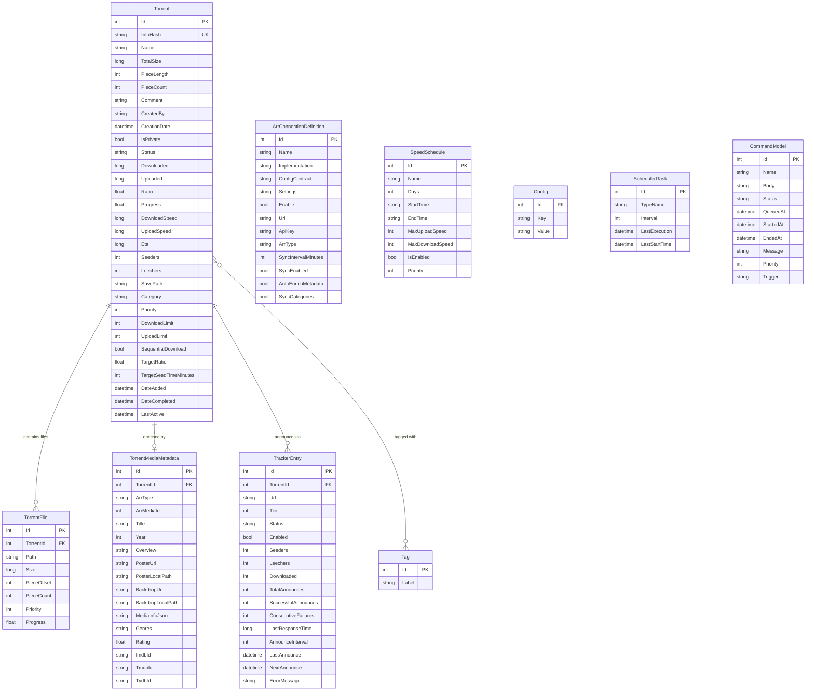
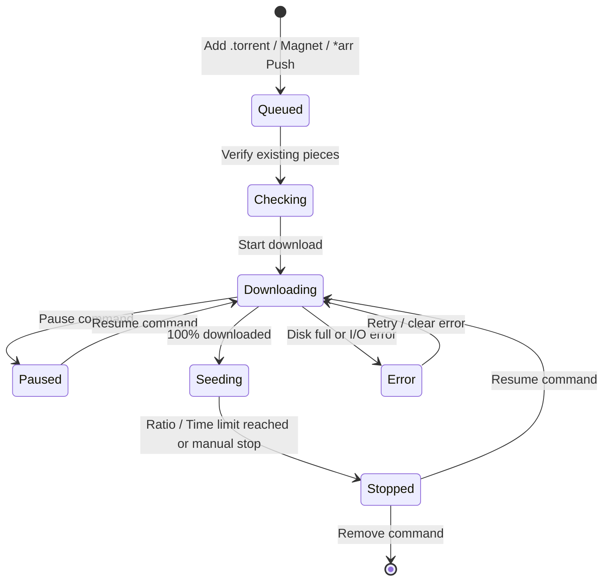

# Leecharr Domain Model

## Entity Relationship Diagram

## Torrent Status Lifecycle

## Status Values

| Status        | Description                                                   |
| :------------ | :------------------------------------------------------------ |
| `Queued`      | Waiting in download queue for available slots                 |
| `Checking`    | Verifying piece hashes against disk files                     |
| `Downloading` | Actively downloading pieces from swarm                        |
| `Seeding`     | 100% complete, actively serving upload pieces to peers        |
| `Paused`      | Download or seeding paused by user                            |
| `Stopped`     | Completed target ratio/time or stopped by user                |
| `Error`       | Encountered disk I/O, storage full, or critical network error |
