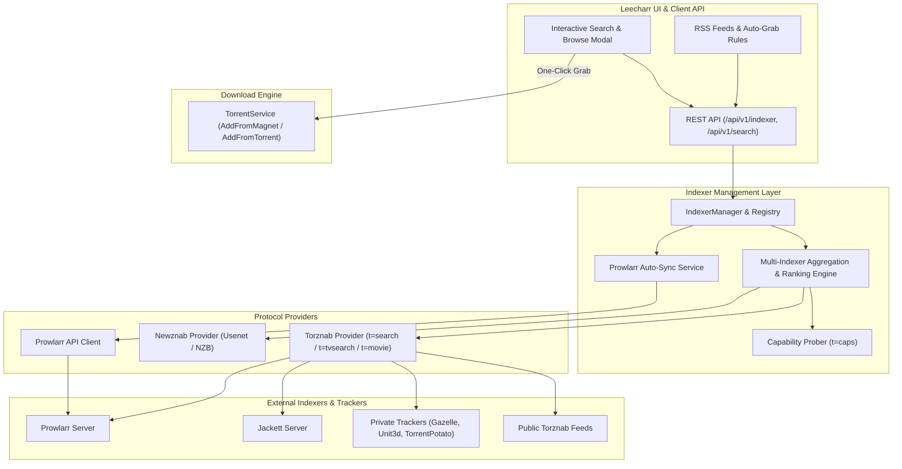

# Direct Indexer Support & Search Specification

## Overview

Leecharr features native, direct **Indexer Support** (Torznab & Newznab) allowing users to search, browse, filter, and grab torrents directly from within the Leecharr web interface or via API, without requiring separate apps for manual discovery.

It also supports direct **Prowlarr Synchronization** to automatically import and keep indexers up-to-date.

---

## 1. System Architecture



---

## 2. Supported Indexer Protocols

### 1. Torznab Protocol
- **Standard:** Extends Newznab XML specification for BitTorrent swarms.
- **Capabilities Query (`t=caps`):** Probes supported categories (e.g. `2000` Movies, `5000` TV, `3000` Audio, `7000` Anime) and search modes (`search`, `tvsearch`, `movie`, `music`, `book`).
- **Search Queries:**
  - Standard text search: `?t=search&q={query}&cat={categories}`
  - TV show search: `?t=tvsearch&q={title}&season={season}&ep={episode}&tvdbid={tvdbId}`
  - Movie search: `?t=movie&q={title}&year={year}&imdbid={imdbId}&tmdbid={tmdbId}`
  - Infohash lookup: `?t=search&infohash={infoHash}`
- **Extended Attributes (`torznab:attr`):**
  - `seeders`: Number of available seeders.
  - `peers` / `leechers`: Number of active leechers.
  - `infohash`: 40-character hex infohash.
  - `magneturl`: Direct magnet URI.
  - `downloadvolumefactor`: Freeleech multiplier (`0.0` = 100% Freeleech, `0.5` = 50% Freeleech, `1.0` = Normal).
  - `uploadvolumefactor`: Double upload multiplier (`2.0` = 2x upload credit).
  - `minimumratio` & `minimumseedtime`: Tracker-specific mandatory seeding requirements.

### 2. Newznab Protocol (Future Usenet Extension)
- Standard NZB indexer protocol for Usenet binary search (`t=search`, `t=tvsearch`, `t=movie`).

---

## 3. Prowlarr Dynamic Synchronization

Leecharr can link directly to a running **Prowlarr** instance:
- **Automatic Discovery:** Connects to Prowlarr via API key (`/api/v1/indexer`).
- **Real-Time Sync:** Automatically imports all enabled Prowlarr indexers into Leecharr.
- **Proxying Support:** Respects FlareSolverr or SOCKS5 proxies configured in Prowlarr.
- **Category Mapping:** Synchronizes Servarr standard category IDs.

---

## 4. Release Schema & Ranking Model

When querying across multiple indexers, Leecharr aggregates, deduplicates, and ranks releases:

### Release Model (`ReleaseInfo`)
| Property | Type | Description |
| :--- | :--- | :--- |
| `indexerId` | `int` | ID of the source indexer. |
| `indexerName` | `string` | Display name of the indexer (e.g. `TorrentLeech`, `IPTorrents`). |
| `title` | `string` | Release name (e.g. `Dune.Part.Two.2024.2160p.UHD.Remux.HEVC.DV.TrueHD.Atmos-FraMeSToR`). |
| `downloadUrl` | `string` | HTTP download link for the `.torrent` file. |
| `magnetUrl` | `string` | Direct magnet link. |
| `infoHash` | `string` | SHA-1 infohash. |
| `size` | `int64` | Total release size in bytes. |
| `publishDate` | `DateTime` | Publication timestamp. |
| `seeders` | `int` | Number of seeders. |
| `leechers` | `int` | Number of leechers. |
| `downloadVolumeFactor` | `double` | Freeleech factor (`0.0` = Freeleech). |
| `uploadVolumeFactor` | `double` | Upload credit factor. |
| `category` | `string` | Standardized category name (`tv`, `movies`, `music`, `anime`, etc.). |
| `quality` | `QualityModel` | Extracted specs: Resolution (`2160p`, `1080p`), Codec (`HEVC`, `AVC`), Audio (`Atmos`, `DTS-HD`), Source (`Remux`, `WEB-DL`, `BluRay`). |

---

## 5. REST API Specification (`/api/v1/indexer` & `/api/v1/search`)

### 1. Indexer CRUD (`/api/v1/indexer`)
- `GET /api/v1/indexer`: List all configured indexers with status, priority, and enabled flags.
- `POST /api/v1/indexer`: Add new Torznab / Newznab indexer definition.
- `PUT /api/v1/indexer/{id}`: Update indexer settings.
- `DELETE /api/v1/indexer/{id}`: Remove indexer.
- `POST /api/v1/indexer/{id}/test`: Test connectivity (`t=caps`) and API key validity.
- `POST /api/v1/indexer/sync-prowlarr`: Force re-synchronization with Prowlarr.

### 2. Search & Grab (`/api/v1/search`)
- `GET /api/v1/search`: Multi-indexer search.
  - **Query Parameters:**
    - `query`: Text query string (e.g. `Blade Runner 2049`).
    - `category`: Category filter (`tv`, `movies`, `music`, `anime`, or Torznab IDs like `2000`).
    - `indexerIds`: Comma-separated indexer IDs to query (empty = all enabled).
    - `minSeeders`: Minimum seeders filter.
    - `freeleechOnly`: Boolean filter for `downloadvolumefactor == 0`.
    - `imdbId` / `tmdbId` / `tvdbId`: Exact media identification queries.
- `POST /api/v1/search/grab`: Grab and start downloading a search result.
  - **Payload:**
    ```json
    {
      "downloadUrl": "https://tracker.example.com/download.php?id=123",
      "magnetUrl": "magnet:?xt=urn:btih:...",
      "title": "Dune.Part.Two.2024.2160p...",
      "category": "movies",
      "savePath": "/downloads/movies",
      "paused": false
    }
    ```

---

## 6. User Experience & UI Workflows

1. **Interactive Search Bar (Top Nav & Dedicated Search Tab):**
   - Instant search with debounced typing.
   - Filter chips: `All`, `Movies`, `TV`, `Music`, `Anime`, `Freeleech Only`, `4K UHD`, `1080p`.
2. **Rich Release Result Cards & Table:**
   - Color-coded swarm health badge: Green (10+ seeders), Amber (1-9 seeders), Red (0 seeders).
   - Freeleech badge (e.g. `FREELEECH`, `50% FREELEECH`).
   - Media poster preview: Automatically parses scene title and renders matched movie/show poster alongside search result.
3. **One-Click Download Modal:**
   - Click "Download" on any result.
   - Pre-fills category based on indexer category mapping.
   - Allows selecting specific files before beginning transfer (via magnet metadata prefetch).
