# Media Enrichment Specification

## Overview

The Media Enrichment Engine in Leecharr bridges the BitTorrent download engine with Sonarr, Radarr, and Lidarr media libraries. Rather than treating downloads as opaque file streams, Leecharr continuously extracts release semantics, queries connected `*arr` instances, downloads high-resolution artwork, and surfaces rich media cards in the user interface.

```mermaid
sequenceDiagram
    participant Arr as Sonarr / Radarr / Lidarr
    participant API as Leecharr API / Webhook
    participant MDE as Media Enrichment Engine
    participant Cache as Local Image & Metadata Cache
    participant UI as React Web UI

    Note over Arr,API: Release Added / Pushed
    Arr->>API: Add Torrent (InfoHash, ReleaseTitle, Category, DownloadId)
    API->>MDE: Enqueue Media Correlation Job
    
    rect rgb(35, 45, 55)
        Note over MDE,Arr: Enrichment Query
        alt Download ID / Transaction Match
            MDE->>Arr: GET /api/v3/queue OR /api/v3/history
        else Release Title Regex Match
            MDE->>Arr: Search by parsed Title & Year (e.g. /api/v3/movie/lookup)
        end
        Arr-->>MDE: Media Payload (Title, Year, Overview, PosterUrl, BackdropUrl, Specs)
        MDE->>Arr: Download Image Assets
        MDE->>Cache: Save local optimized thumbnails
    end

    MDE->>UI: SignalR Broadcast: "TorrentMediaEnriched"
    UI-->>UI: Instantly render Movie Poster / TV Banner card
```

## Correlation & Matching Rules

1. **Multi-Instance Category Mapping:**
   - Supports multiple concurrent Sonarr/Radarr/Lidarr instances connected to the same Leecharr host via unique category names:
     - `tv`, `tv-sonarr`, `sonarr-anime`, `sonarr-4k` &rarr; Route queries to specific Sonarr instances.
     - `movies`, `radarr`, `radarr-4k`, `radarr-anime` &rarr; Route queries to specific Radarr instances.
     - `music`, `lidarr` &rarr; Route queries to Lidarr instances.

2. **Download ID Correlation:**
   - When an `*arr` app pushes a download via Deluge/qBittorrent/Leecharr API, Leecharr tags the download with the caller's transaction ID for 100% exact correlation.

3. **Release Title Scene Parser:**
   - Automatically parses release names (`Title.Year.Quality.Source.Codec-Group` or `Show.S01E02.Quality...`) into normalized title, release year, season number, episode number, quality resolution, and audio codec.
   - Queries connected `*arr` instances for match even for manually uploaded `.torrent` files or magnet links.

4. **Unmatched / Non-Media Torrents & Manual Identification:**
   - For generic downloads (e.g., Linux ISOs, software archives, or non-scene release names) that do not return a match from connected Servarr libraries:
     - Renders a clean generic card with file-type badges (`ISO`, `ZIP`, `EXE`, `ROM`).
     - Provides an interactive **"Match / Identify Media"** button opening a search dialog to manually search Sonarr/Radarr/Lidarr and link the torrent to a movie/show entity.

## Media Stream Specs Extraction

For media files, Leecharr inspects container headers (MKV, MP4, FLAC, MP3) using **TagLib#** and pure EBML analyzers to extract:
- **Video:** Resolution (4K UHD, 1080p, 720p), Video Codec (HEVC/H.265, AVC/H.264, AV1), Color Profile (HDR10, HDR10+, Dolby Vision, SDR), Frame Rate.
- **Audio:** Codecs (Dolby Atmos, TrueHD 7.1, DTS-HD MA, DD+ 5.1, AAC, FLAC 24-bit), Audio Channels, Languages.
- **Subtitles:** Embedded subtitle languages and formats (SRT, PGS, ASS/SSA).

---

## Local Artwork & Metadata Cache Lifecycle

1. **Storage Location:** High-resolution posters and fanart backdrops are cached locally under `/config/MediaCache/{torrentId}/`.
2. **Immediate Cleanup on Removal:** When a torrent is deleted from Leecharr (via UI, API, or Servarr client call), its associated cached posters, fanart thumbnails, and metadata rows are immediately deleted from disk and the database to prevent orphaned storage bloat.
