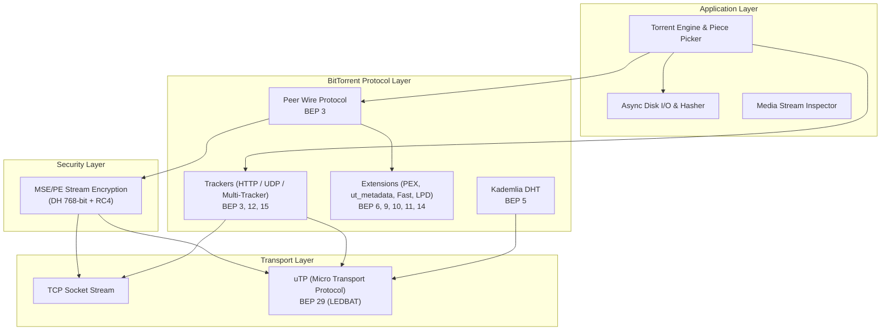

# BitTorrent Protocol Implementations in Leecharr

## Protocol Stack

## BEP Standards Implemented

- **BEP 3 (BitTorrent Protocol Specification):** Peer handshake, KeepAlive, Choke/Unchoke, Interested/NotInterested, Have, Bitfield, Request (16 KB blocks), Piece, Cancel.
- **BEP 5 (Distributed Hash Table - DHT):** Kademlia routing table, compact node info, KRPC `ping`, `find_node`, `get_peers`, `announce_peer`.
- **BEP 6 (Fast Extension):** `AllowedFast` set calculation, `SuggestPiece`, `RejectRequest`, `HaveAll`, `HaveNone`.
- **BEP 9 (Metadata Exchange - `ut_metadata`):** Magnet link resolution and piece-by-piece metadata downloading over peer connections.
- **BEP 10 (Extension Protocol):** Standardized dictionary handshake (`m` map) and extended message framing.
- **BEP 11 (Peer Exchange - PEX):** `ut_pex` for fast swarm discovery.
- **BEP 12 (Multi-Tracker Extension):** Tiered announce lists and failover logic.
- **BEP 14 (Local Peer Discovery - LPD):** Multicast announces over `239.192.152.143:6771`.
- **BEP 15 (UDP Tracker Protocol):** Binary 98-byte connect and announce protocol with transaction validation.
- **BEP 29 (uTP Transport):** User Datagram Protocol transport with LEDBAT congestion control and TCP fallback.
- **MSE / PE Encryption:** Diffie-Hellman 768-bit key negotiation and RC4 stream encryption with initial 1024-byte discard.
