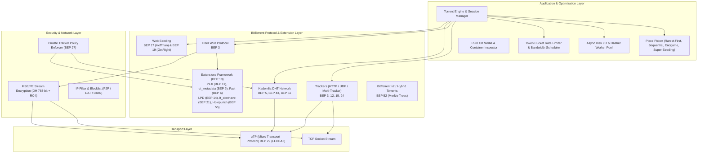

# BitTorrent Protocol & Feature Implementations in Leecharr

## 1. Protocol Architecture Stack

Leecharr implements a pure C# BitTorrent protocol engine that conforms strictly to the BitTorrent Enhancement Proposals (BEPs) and client features found in leading clients (qBittorrent, Deluge, Transmission, uTorrent).

---

## 2. Complete BEP Standards Catalog

| BEP | Name | Category | Implementation Details |
| :--- | :--- | :--- | :--- |
| **BEP 3** | The BitTorrent Protocol Specification | Core | 68-byte handshake, Choke, Unchoke, Interested, NotInterested, Have, Bitfield, Request (16 KB blocks), Piece, Cancel, Port, KeepAlive. |
| **BEP 5** | DHT Protocol | Discovery | Kademlia routing table (K=8), KRPC messages (`ping`, `find_node`, `get_peers`, `announce_peer`), token rotation (10m), compact node encoding, bootstrap routers. |
| **BEP 6** | Fast Extension | Transport | `SuggestPiece` (0x0D), `HaveAll` (0x0E), `HaveNone` (0x0F), `RejectRequest` (0x10), `AllowedFast` (0x11) calculated via SHA-1(/24 IP + infohash). |
| **BEP 9** | Extension for Peers to Send Metadata Files (`ut_metadata`) | Magnet | Enables metadata downloading piece-by-piece directly from peer swarm to resolve magnet links into full `.torrent` metadata on-the-fly. |
| **BEP 10** | Extension Protocol | Core | Standardized dictionary-based extension handshake (`m` mapping) allowing dynamic capability negotiation and custom sub-protocols. |
| **BEP 11** | Peer Exchange (`ut_pex`) | Discovery | High-speed peer discovery within active swarms via compact 6-byte peer lists and flag bits (encryption, seed status, uTP preference). |
| **BEP 12** | Multitracker Metadata Extension | Trackers | Tiered announce lists, random tier ordering, tier failover, and configurable simultaneous tier announcing. |
| **BEP 14** | Local Peer Discovery (LPD) | Discovery | Multicast announcing over UDP (`239.192.152.143:6771`) with HTTP-style `BT-SEARCH` headers for high-speed local LAN transfers. |
| **BEP 15** | UDP Tracker Protocol | Trackers | Binary 98-byte connection and announce protocol with transaction ID verification, exponential backoff retries, and compact peer responses. |
| **BEP 17** | HTTP Seeding (Hoffman-style) | Web Seeds | Downloads missing pieces from HTTP mirrors using URL templates (`/file?piece=N`). |
| **BEP 19** | HTTP/FTP Seeding (GetRight-style) | Web Seeds | Downloads ranges from HTTP/FTP web mirrors via standard HTTP Range headers. |
| **BEP 20** | Peer ID Conventions | Identification | Standard Azureus-style Peer IDs (`-LC1000-...`) with configurable client emulation prefixes. |
| **BEP 21** | Extension for Partial Seeds (`lt_donthave`) | Swarm | Informs peers when a client does not have specific pieces (useful when downloading selective files). |
| **BEP 23** | Compact Peer List Format | Trackers | Standard 6-byte binary representation (4-byte IPv4 + 2-byte port) minimizing announce response payload sizes. |
| **BEP 24** | Tracker Returns External IP | Network | Extracts public IPv4/IPv6 address from tracker responses for NAT and port forwarding detection. |
| **BEP 27** | Private Torrents | Privacy | Strict enforcement of `info.private = 1`: automatically disables DHT, PEX, and LPD to guarantee private tracker ratio integrity. |
| **BEP 29** | Micro Transport Protocol (uTP) | Transport | UDP-based transport featuring LEDBAT congestion control (detects background delay increases and throttles back gracefully to prevent home network saturation). |
| **BEP 38** | Finding Local Peers | Network | IPv4 and IPv6 local peer determination to prioritize unmetered LAN traffic. |
| **BEP 40** | Canonical Peer Priority | Optimization | Deterministic peer tie-breaking and priority queueing to optimize swarm interconnectivity. |
| **BEP 43** | Read-Only DHT Nodes | Discovery | Allows bandwidth-constrained clients to participate as leaf queries without cluttering routing tables. |
| **BEP 51** | DHT Infohash Indexing | Discovery | Fast indexing of active infohashes across DHT nodes. |
| **BEP 52** | BitTorrent v2 Specification | Core | Per-file Merkle tree hashing (SHA-256) with 16 KB block-level verification and hybrid v1+v2 torrent compatibility. |
| **BEP 55** | Holepunch Extension | NAT Traversal | Coordinates UDP/uTP rendezvous between two firewalled peers via a common connected peer. |

---

## 3. Advanced Engine Mechanics

```mermaid
sequenceDiagram
    participant P as Peer Swarm
    participant E as Torrent Engine
    participant K as Piece Picker
    participant D as Async Disk Writer
    participant M as Media Inspector

    Note over P,E: Peer Connection & MSE Handshake
    P->>E: TCP/uTP Connect + MSE/PE Key Exchange (DH 768-bit)
    E->>P: Bitfield & Fast Extension Handshake
    
    rect rgb(30, 45, 60)
        Note over E,K: Piece Selection Strategy
        E->>K: Evaluate Piece Availabilities
        alt Normal Mode
            K-->>E: Pick Rarest-First Pieces
        else Sequential Mode (Preview)
            K-->>E: Pick Head/Tail + Sequential Piece Stream
        else Endgame Mode (Remaining < 20 blocks)
            K-->>E: Broadcast Duplicate Block Requests
        end
    end

    Note over E,P: Block Transfer (16 KB Blocks)
    E->>P: Send REQUEST(index, begin, length)
    P-->>E: Receive PIECE(index, begin, block)

    Note over E,D: Non-Blocking Disk Write & Verify
    E->>D: Enqueue Block to Write Cache
    D->>D: Flush to Sparse File on Disk
    D->>D: Run SHA-1 / SHA-256 Piece Verification
    D-->>E: Piece Verified OK -> Broadcast HAVE

    opt First Media Piece Downloaded
        E->>M: Inspect MKV/MP4 Container Header
        M-->>E: Extracted Specs (4K, HEVC, Atmos, HDR10+)
    end
```

### 3.1 Piece Picker Algorithms
- **Rarest-First Algorithm:** Tracks piece availability counts across all connected peers. Prioritizes rarest pieces to maximize piece diversity in the swarm.
- **Sequential Download Mode:** Orders piece requests sequentially from beginning to end, with special prioritization of container headers (first 2% and last 1% for MP4 `moov` or MKV seekheads) to enable streaming and immediate metadata inspection.
- **Endgame Mode:** Activated when all remaining un-downloaded blocks are already in-flight. Requests duplicate copies of remaining blocks from all unchoked peers; when a block arrives, `CANCEL` messages are immediately dispatched to others.
- **Super-Seeding (Initial Seeding):** When creating or initially seeding a rare torrent, presents itself as having only one new piece at a time until that piece is shared with others, preventing leechers from downloading redundant blocks.

### 3.2 MSE / PE Stream Encryption
- **Key Exchange:** Diffie-Hellman 768-bit MODP prime (RFC 3526).
- **Stream Cipher:** RC4 stream cipher with the first 1024 bytes of keystream discarded.
- **Policies:**
  - `PreferEncrypted` (Default): Initiates encrypted handshakes; falls back to plaintext if peer rejects encryption.
  - `RequireEncrypted`: Strictly drops non-encrypted handshakes.
  - `PreferPlainText`: Initiates plaintext; accepts encrypted if requested by peer.

### 3.3 Asynchronous Disk Engine & Caching
- **Dedicated Non-Blocking I/O Queue:** Prevents disk I/O latency from blocking network sockets.
- **Configurable Memory Write Cache:** Batches 16 KB blocks in memory (default: 128 MB, configurable up to 2 GB) before issuing sequential disk writes.
- **Sparse File Allocation:** Uses filesystem sparse allocation (instant start, non-blocking) with optional pre-allocation (`fallocate`).
- **Fast Resume Persistence:** Serializes bitfields, verified piece masks, and byte totals to SQLite on shutdown and periodically every 5 minutes.

### 3.4 Private Tracker Compliance & Client Emulation Presets
- **Strict BEP 27 Enforcement:** When `info.private = 1` is present in torrent metadata:
  - DHT (BEP 5), Peer Exchange / PEX (BEP 11), and Local Peer Discovery (BEP 14) are **strictly and automatically disabled** to preserve tracker ratio accounting and prevent unauthorized peer leaks.
- **Customizable User-Agent & Peer-ID Emulation:**
  - Configurable identification presets allowing Leecharr to emulate standard whitelisted clients on private trackers if required:
    - `Leecharr` (Default: `-LC1000-...`, `Leecharr/1.0.0`)
    - `qBittorrent` (`-qB4420-...`, `qBittorrent/4.4.2`)
    - `Deluge` (`-DE2050-...`, `Deluge/2.0.5 libtorrent/1.2.14.0`)
    - `Transmission` (`-TR3000-...`, `Transmission/3.00`)

### 3.5 GeoIP Peer Resolution & MaxMind Integration
- **Automated Database Maintenance:** Automatically downloads and updates the `GeoLite2-Country.mmdb` database into `/config/GeoIP/` on first initialization and runs a monthly background refresh.
- **Swarm Country Badges:** Resolves peer IPv4/IPv6 addresses to ISO 3166-1 alpha-2 country codes to render country flags in the Swarm Inspector.

### 3.6 Network Interface Binding & VPN Kill Switch
- **Interface Binding:** Ability to explicitly bind BitTorrent sockets, UDP trackers, and DHT traffic to a specific network interface (e.g. `tun0`, `wg0`, `eth0`, `en0`) or specific IP address.
- **VPN Kill Switch:** If the bound interface becomes disconnected or unassigned, the engine automatically and immediately halts all active connections and pauses tracker announces to prevent unencrypted public IP leaks.

### 3.7 SOCKS5 / HTTP Proxy & Anonymous Mode
- **Proxy Protocols:** SOCKS5 (with/without authentication) and HTTP CONNECT proxies.
- **Granular Proxy Toggles:**
  - `Proxy Peer Connections`: Routes peer data transfers through proxy.
  - `Proxy Tracker Connections`: Routes tracker announce requests through proxy.
  - `Proxy Indexer Requests`: Routes Torznab/Newznab searches through proxy.
- **Anonymous Mode:** Hides user-agent strings, omits local IP from peer handshakes, and disables peer identification leaks.
