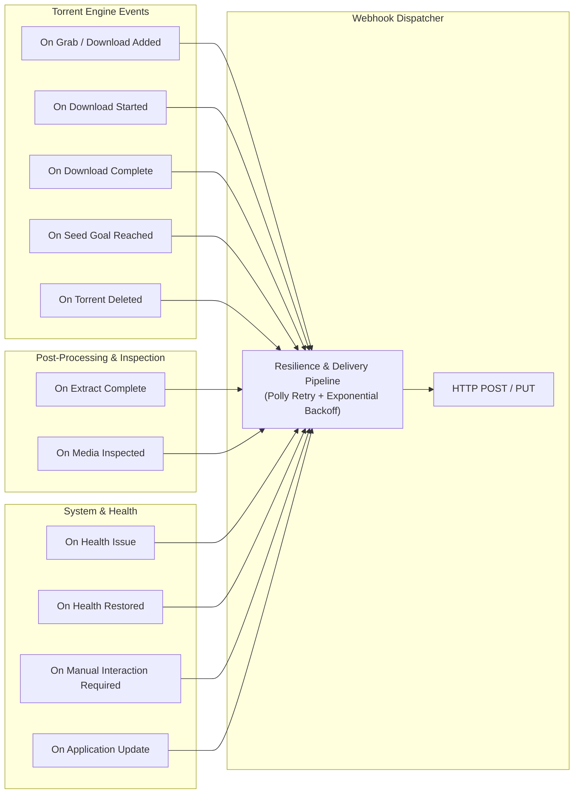

# Webhook & Notification Connections Specification

## Overview

Leecharr supports custom **Webhook Connections** and notification integrations adhering to the standard Servarr (`*arr`) UI and architectural pattern. Webhooks allow external applications (Home Assistant, Discord bots, Plex/Jellyfin notifiers, custom scripts, or `*arr` automation workflows) to receive real-time HTTP POST/PUT event notifications with full rich media metadata and download telemetry.

---

## 1. Webhook Connection Configuration Schema

As shown in the Servarr Connection settings UI, each Webhook connection is configured with:

| Field                     | Type                 | Description                                                                                    |
| :------------------------ | :------------------- | :--------------------------------------------------------------------------------------------- |
| **Name**                  | `string`             | User-defined label for the connection (default: `Webhook`).                                    |
| **Notification Triggers** | `flags` / `bools`    | Configurable event trigger toggles (detailed below).                                           |
| **Tags**                  | `int[]` / `string[]` | Tag filter: only send notifications for torrents with at least one matching tag (empty = all). |
| **Webhook URL**           | `string`             | The destination HTTP/HTTPS endpoint to invoke.                                                 |
| **Method**                | `enum`               | HTTP Method: `POST` (default) or `PUT`.                                                        |
| **Username**              | `string`             | Optional HTTP Basic Authentication username.                                                   |
| **Password**              | `string`             | Optional HTTP Basic Authentication password.                                                   |
| **Custom Headers**        | `dictionary`         | Optional HTTP headers (e.g. `Authorization: Bearer <token>`, `X-Custom-Header: value`).        |

---

## 2. Notification Triggers for Leecharr



### Supported Event Triggers

1. **On Grab / Download Added (`OnGrab`):** Fired immediately when a new `.torrent` or magnet link is added to Leecharr (via API, watch folder, or Sonarr/Radarr/Lidarr push).
2. **On Download Complete (`OnDownloadComplete` / `OnImportComplete`):** Fired when piece verification reaches 100% and all wanted files are fully written to disk.
3. **On Media Inspected (`OnMediaInspected`):** Fired when the Pure C# Container Inspector extracts stream properties (4K/HDR/Atmos/codecs).
4. **On Extract Complete (`OnExtractComplete`):** Fired when an archive extraction (rar/zip/7z) finishes.
5. **On Seed Goal Reached (`OnSeedGoalReached`):** Fired when a torrent satisfies its target share ratio or seed time limit.
6. **On Torrent Deleted (`OnTorrentDeleted`):** Fired when a torrent is removed from the download list.
7. **On Health Issue (`OnHealthIssue`):** Fired on tracker communication failure, disk space warnings (< 5% free), write I/O errors, or corrupted piece detections.
8. **On Health Restored (`OnHealthRestored`):** Fired when a previous health issue returns to normal.
9. **On Manual Interaction Required (`OnManualInteractionRequired`):** Fired when a download stalls, requires missing credentials, or encounters unrecoverable disk errors.
10. **On Application Update (`OnApplicationUpdate`):** Fired after a successful application upgrade/restart.
11. **On Test (`OnTest`):** Fired when the user clicks the **Test** button in the connection modal.

---

## 3. JSON Webhook Payload Schema

Leecharr dispatches a standardized, rich JSON payload containing instance info, event type, torrent state, and enriched media library metadata:

### Example: `DownloadComplete` Webhook Payload

```json
{
  "eventType": "DownloadComplete",
  "instanceName": "Leecharr",
  "applicationVersion": "1.0.0",
  "timestamp": "2026-08-31T10:54:21Z",
  "torrent": {
    "id": 42,
    "name": "House.of.the.Dragon.S02E08.2160p.HMAX.WEB-DL.DDP5.1.Atmos.DV.HDR10.H.265-FLUX",
    "infoHash": "a1b2c3d4e5f60718293a4b5c6d7e8f9012345678",
    "category": "tv",
    "savePath": "/downloads/tv/House.of.the.Dragon.S02E08.2160p.HMAX.WEB-DL.DDP5.1.Atmos.DV.HDR10.H.265-FLUX",
    "totalSize": 8589934592,
    "downloaded": 8589934592,
    "uploaded": 4294967296,
    "ratio": 0.5,
    "progress": 1.0,
    "dateAdded": "2026-08-31T10:00:00Z",
    "dateCompleted": "2026-08-31T10:54:21Z",
    "downloadTimeSeconds": 3261,
    "tags": ["sonarr", "4k-hdr"]
  },
  "media": {
    "arrType": "sonarr",
    "arrMediaId": 105,
    "title": "House of the Dragon",
    "year": 2022,
    "seasonNumber": 2,
    "episodeNumber": 8,
    "episodeTitle": "The Queen Who Ever Was",
    "overview": "As the season reaches its climax, dragons clash over Westeros...",
    "posterUrl": "http://localhost:7889/api/v1/media/artwork/42/poster",
    "backdropUrl": "http://localhost:7889/api/v1/media/artwork/42/backdrop",
    "rating": 8.5,
    "imdbId": "tt11198330",
    "tmdbId": "94997",
    "tvdbId": "371572"
  },
  "streamSpecs": {
    "container": "Matroska",
    "resolution": "3840x2160 (4K UHD)",
    "videoCodec": "HEVC (H.265)",
    "hdrFormat": "Dolby Vision / HDR10",
    "audioCodec": "E-AC-3 (Dolby Digital Plus)",
    "audioChannels": "5.1 Surround",
    "audioProfile": "Dolby Atmos",
    "subtitleLanguages": ["eng", "fre", "ger", "spa"]
  },
  "files": [
    {
      "path": "House.of.the.Dragon.S02E08.2160p.HMAX.WEB-DL.DDP5.1.Atmos.DV.HDR10.H.265-FLUX.mkv",
      "size": 8589934592,
      "progress": 1.0
    }
  ]
}
```

### Example: `HealthIssue` Webhook Payload

```json
{
  "eventType": "HealthIssue",
  "instanceName": "Leecharr",
  "applicationVersion": "1.0.0",
  "timestamp": "2026-08-31T10:54:21Z",
  "health": {
    "source": "DiskSpace",
    "type": "Warning",
    "message": "Free disk space on volume '/downloads' is below 5% (12.4 GB remaining).",
    "path": "/downloads"
  }
}
```

### Example: `Test` Webhook Payload

```json
{
  "eventType": "Test",
  "instanceName": "Leecharr",
  "applicationVersion": "1.0.0",
  "timestamp": "2026-08-31T10:54:21Z",
  "message": "Testing webhook connection from Leecharr."
}
```

---

## 4. Webhook Delivery & Resilience Architecture

1. **Non-Blocking Background Delivery:** Webhook dispatches are decoupled from download processing via the Command Queue.
2. **Polly Retry Pipeline:**
   - Retries up to 3 times with exponential backoff (2s, 4s, 8s) on transient network errors (HTTP 5xx, timeout, connection dropped).
   - 10-second timeout per attempt.
3. **SSRF & Private Network Protection:** `UrlValidator.IsSafeUrl` validation to prevent malicious intranet SSRF requests while allowing explicit user whitelisting for local home lab destinations (e.g. `http://192.168.1.100:8123` for Home Assistant).
4. **Interactive Connection Testing:** The `/api/v1/notifications/{id}/test` endpoint validates the target endpoint immediately, returning response HTTP status code and latency.
